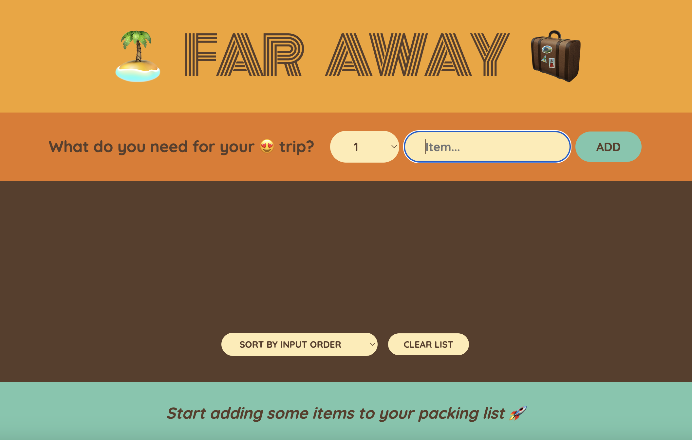
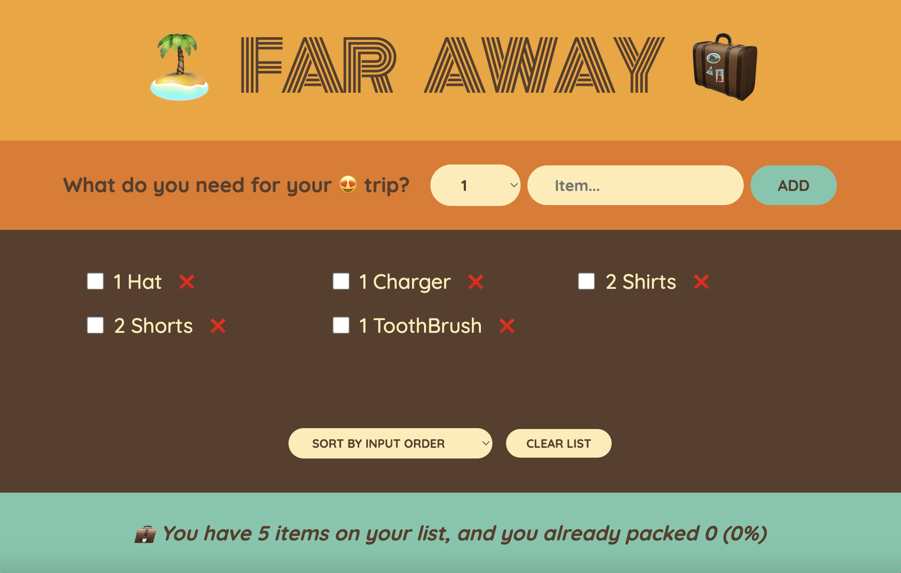
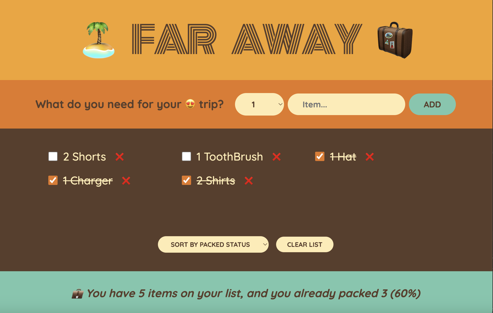
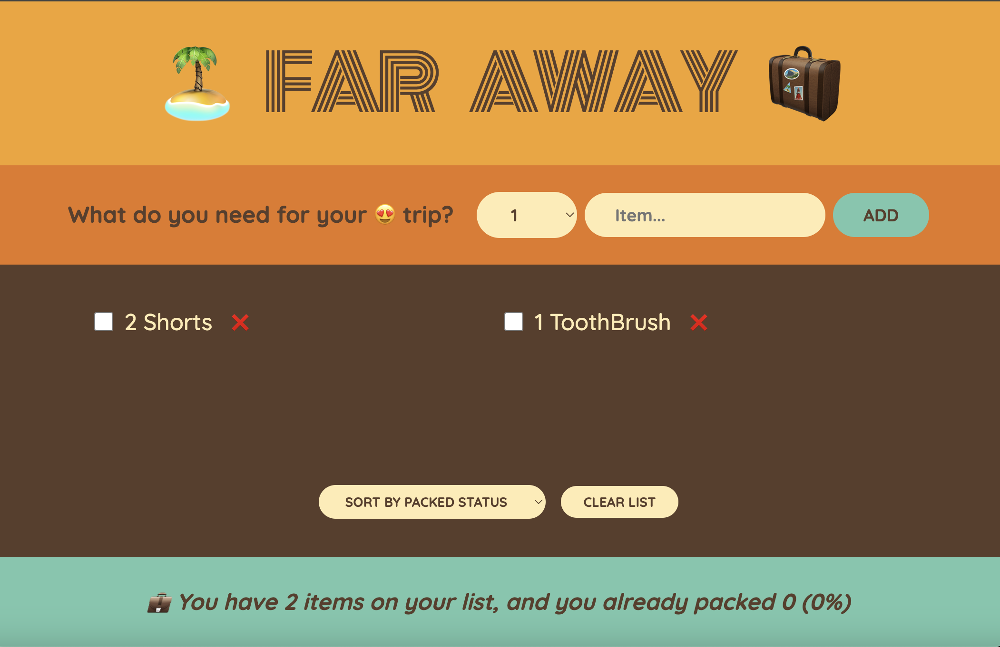

# Travel Packing List

## User Story

As a traveler,
I want to add items to a packing list with quantities,
So that I can easily track what I need to pack and ensure I don't forget anything.

## Acceptance Criteria

GIVEN the user is planning a trip and needs to pack,
WHEN they add an item to the packing list with its quantity,
THEN the item should be added to the list, visible with the specified quantity.

GIVEN the user has packed some items,
WHEN they check off an item,
THEN the item should be marked accordingly, and the app should update to show the percentage of items still left to pack.

GIVEN the user wants to organize their packing list,
WHEN they choose to sort by "packed status," "description," or "input order",
THEN the app should reorder the list based on the selected sorting criteria.

GIVEN the user has completed packing and no longer needs the list,
WHEN they select the option to clear the list,
THEN the app should remove all items from the list.

## Mock-Up

When the user opens up page:

When the user adds items:

When the user checks off items:

When the user deletes checked off items:

---

© Adriana Nino [GitHub Repo](https://github.com/ninadri/travel-list)
